# HarborFM Themes

Extra page themes for [HarborFM](https://github.com/LoganRickert/harborfm).

HarborFM already ships with **Fluid** and **Folio**. This repo is the gallery of additional themes you can download as zips, import on the Themes page, and assign to a show. Live listings live on [harborfm.com/themes](https://harborfm.com/themes/).

Layouts and page counts vary on purpose so shows do not all look the same.

## Gallery

| Theme | Style |
|-------|-------|
| [Nightwire](nightwire/) | Cyber / underground |
| [Pitchside](pitchside/) | Sports talk |
| [Stacks](stacks/) | Books / ideas |
| [Hot Mic](hotmic/) | Comedy / open mic |
| [Orbit Lab](orbitlab/) | Science / tech |
| [Timberline](timberline/) | Outdoors |
| [Annals](annals/) | History / archive |
| [Soliloquy](soliloquy/) | Personal / growth |
| [Wayfarer](wayfarer/) | Travel |
| [Castellan](castellan/) | Medieval / chronicle |
| [Glasshouse](glasshouse/) | Business / leadership |
| [Neon Reel](neonreel/) | Film / culture |
| [Atelier](atelier/) | Interview / fashion |
| [Casefile](casefile/) | True crime / dossier |

For how themes work (files, mounts, import checklist), see the [Theme Authoring Guide](https://harborfm.com/theme-guide/) or [`theme-SKILL.md`](../web/public/theme-SKILL.md) in the main HarborFM repo if you are generating a theme with an agent.

## What’s in a theme

```text
atelier/
├── theme.json           # id, name, version, pages
├── templates/           # Liquid pages and _partials
├── css/
│   └── atelier.css      # auto-linked by HarborFM
├── images/
│   ├── preview.jpg      # gallery / picker card
│   └── …                # heroes, stills, etc.
└── fonts/               # optional .woff2 / .ttf
```

## Use these themes locally

Clone this repo next to HarborFM:

```bash
git clone https://github.com/LoganRickert/harborfm-themes.git harborfm-themes
```

### Sync into a running HarborFM instance

From the HarborFM root (with this folder at `harborfm/harborfm-themes`):

```bash
pnpm themes:sync
```

Or from this directory:

```bash
node scripts/sync-dev.mjs
```

That copies packages into the server theme data dir (no zip step). After edits, sync again, hard-refresh the public feed, and pick the theme under **Page Customizations**.

### Pack zips locally

Needs `zip` on your PATH:

```bash
node scripts/validate-and-pack.mjs
ls dist/
```

Each theme zip is addressed by a per-theme release tag (`{id}-v{version}`). The catalog index is published separately under a long-lived `catalog` release.

### Preview the docs Themes page

With HarborFM docs running (`pnpm dev` in `docs/`, usually port 4321), a packed `dist/` is picked up automatically and served from `/theme-gallery/`:

```bash
# from this repo
node scripts/validate-and-pack.mjs

# from HarborFM docs/
pnpm dev
# open http://localhost:4321/themes/
```

To force the published GitHub catalog instead: `THEMES_CATALOG_REMOTE=1 pnpm dev`.

To write local asset URLs into the catalog:

```bash
DOWNLOAD_BASE=/theme-gallery node scripts/validate-and-pack.mjs
```

## Publish a release

1. Bump `version` in each theme you changed (`theme.json`).
2. Push the theme packages.
3. Run the **Publish theme zips** workflow (or push a `publish-*` / `v*` tag).
4. CI packs all themes, uploads only new/changed `{id}-v{version}` releases, and replaces `catalog.json` on the stable `catalog` release.

Stable catalog URL:

```text
https://github.com/LoganRickert/harborfm-themes/releases/download/catalog/catalog.json
```

Unchanged themes keep their existing download URLs. Changing a package without bumping its version fails the publish check.

## Previews

### [Nightwire](nightwire/)

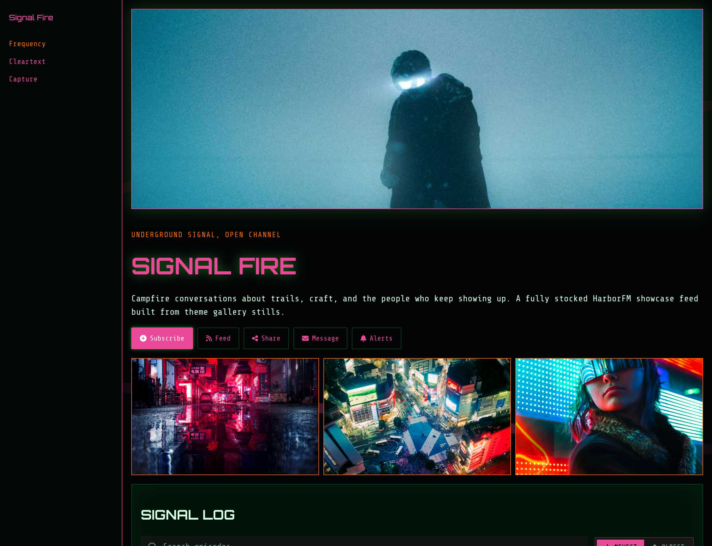

### [Pitchside](pitchside/)

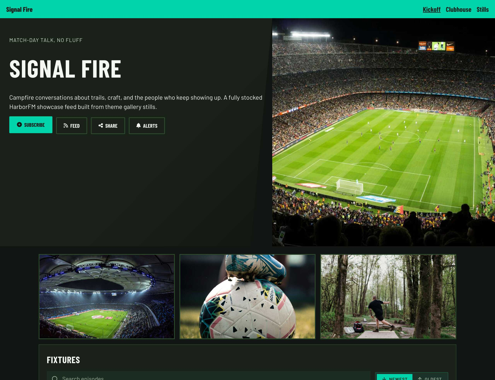

### [Stacks](stacks/)


### [Hot Mic](hotmic/)

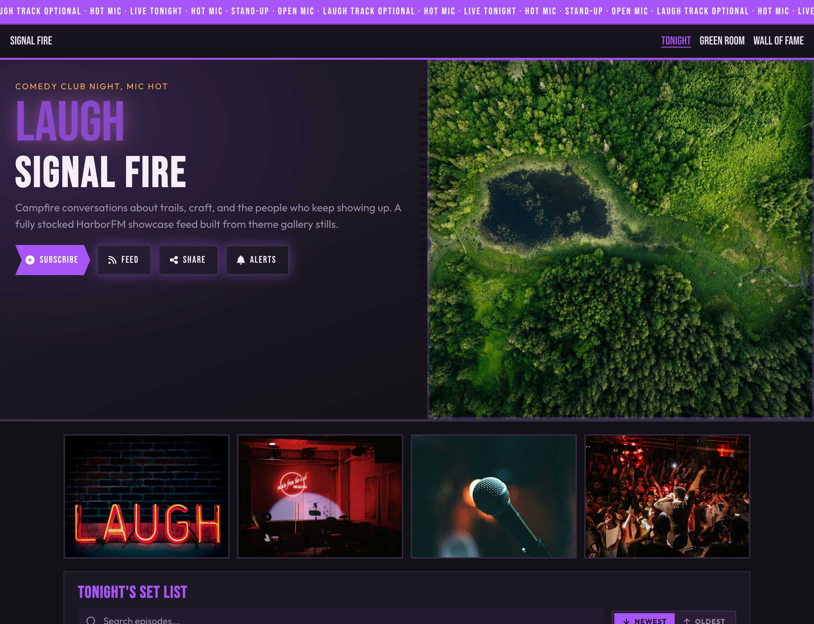

### [Orbit Lab](orbitlab/)

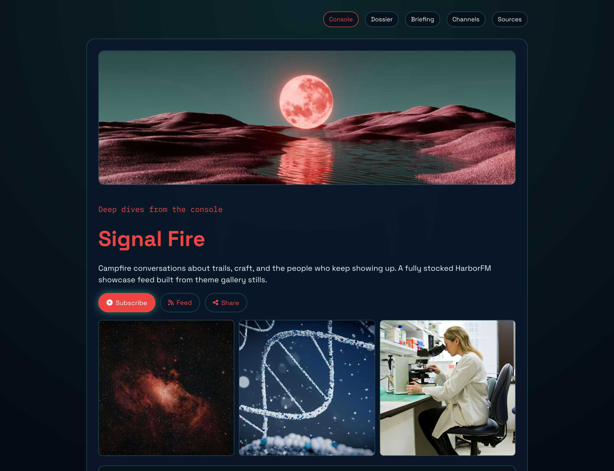

### [Timberline](timberline/)

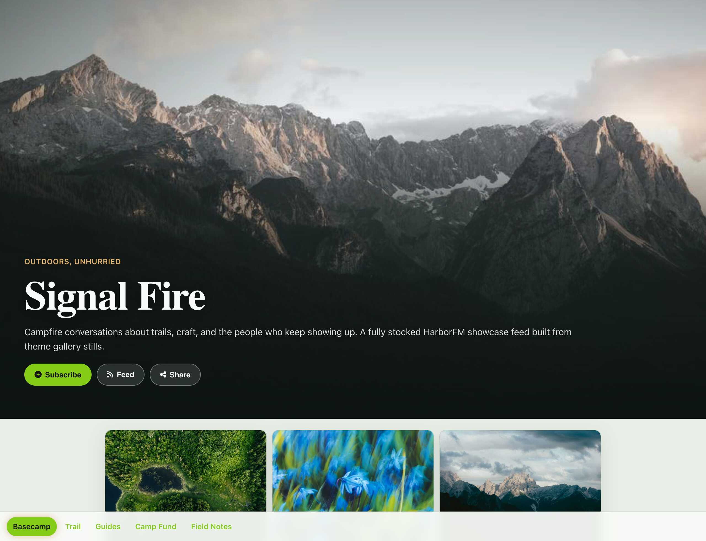

### [Annals](annals/)

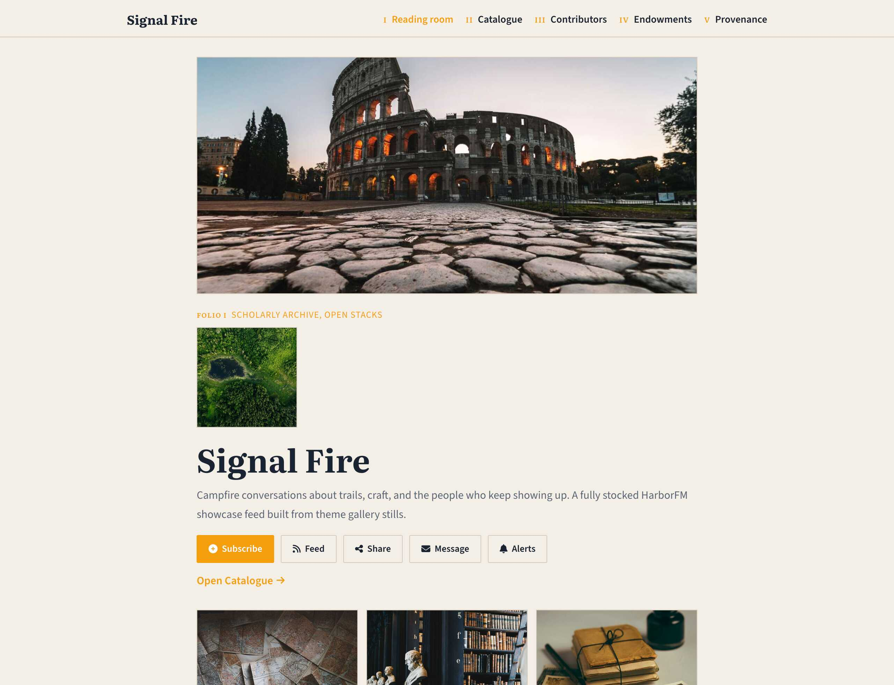

### [Soliloquy](soliloquy/)

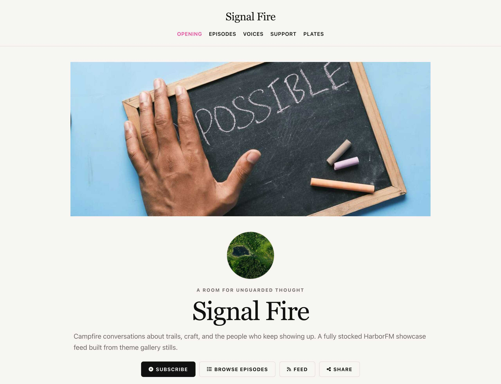

### [Wayfarer](wayfarer/)

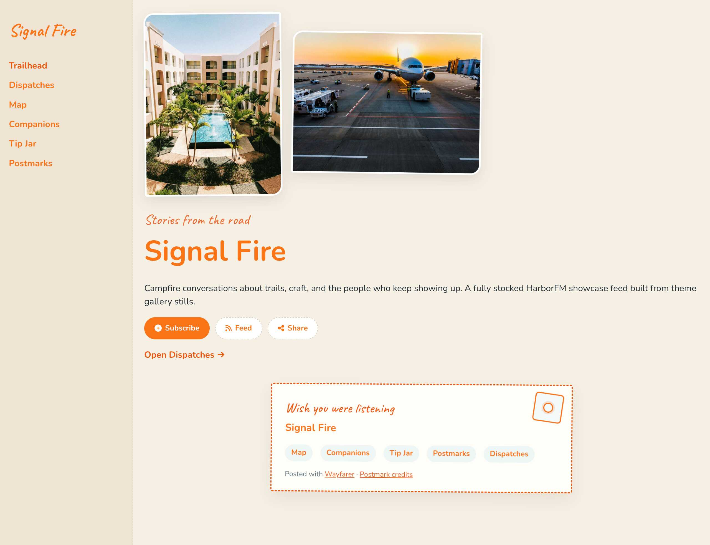

### [Castellan](castellan/)

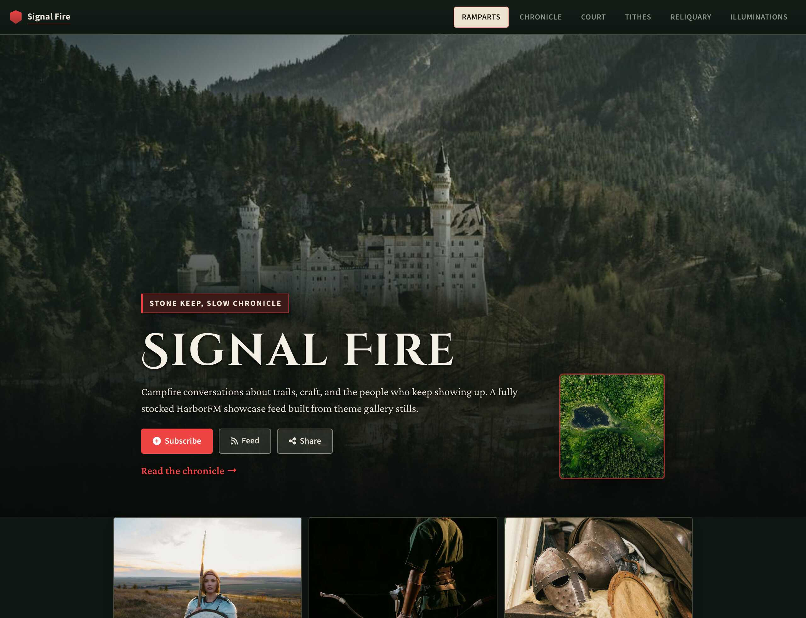

### [Glasshouse](glasshouse/)

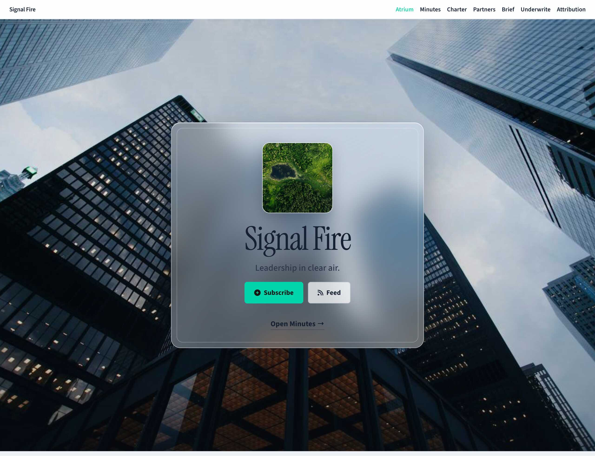

### [Neon Reel](neonreel/)

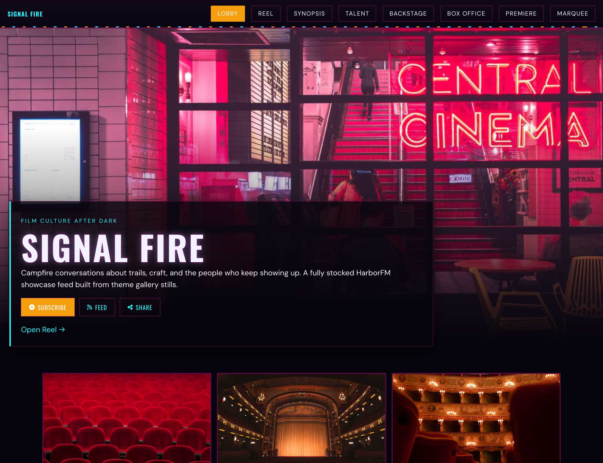

### [Atelier](atelier/)

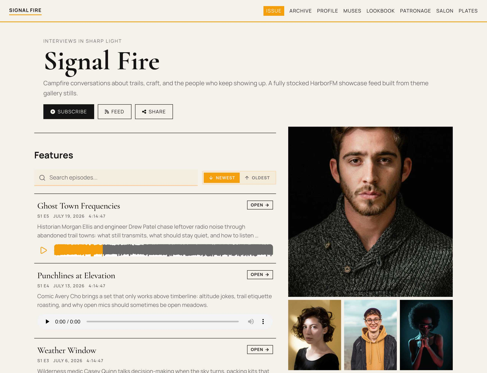

### [Casefile](casefile/)

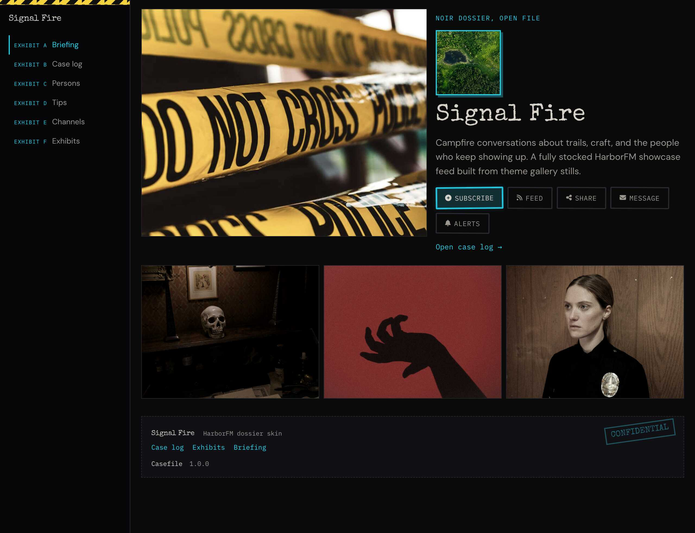
